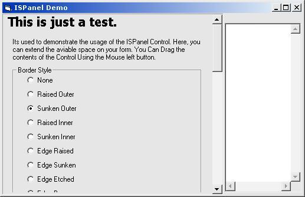



## ISPanel 1\.1 Scroll Form's Content\!

### Description

This is the last Version of the ISPannel Control, A control that allows programmers to extend the aviable space in their forms, adding the posibility of show scrollbars, and now, also select a borderstyle.

please leave comments.
 
### More Info
 

             |
---                |---
**Submitted On**   |2003-05-01 19:11:02
**By**             |[Fred\.cpp](https://github.com/Planet-Source-Code/PSCIndex/blob/master/ByAuthor/fred-cpp.md)
**Level**          |Intermediate
**User Rating**    |5.0 (40 globes from 8 users)
**Compatibility**  |VB 5\.0, VB 6\.0
**Category**       |[Custom Controls/ Forms/  Menus](https://github.com/Planet-Source-Code/PSCIndex/blob/master/ByCategory/custom-controls-forms-menus__1-4.md)
**World**          |[Visual Basic](https://github.com/Planet-Source-Code/PSCIndex/blob/master/ByWorld/visual-basic.md)
**Archive File**   |[ISPanel\_1\_158190512003\.zip](https://github.com/Planet-Source-Code/fred-cpp-ispanel-1-1-scroll-form-s-content__1-45171/archive/master.zip)

### API Declarations

Some

